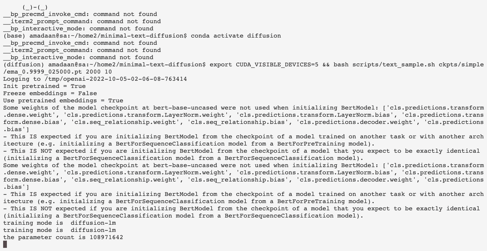

# Minimal text diffusion


_A minimal implementation of diffusion models of text: learns a diffusion model of a given text corpus, allowing to generate text samples from the learned model._


----


|  |
|:--:|
| <b> Diffusion in action:</b> a DDPM model gradually denoising random text _`hotnutggy pi greentedsty rawyaented`_ to _`the white eggplant is dried`_ and _`mac clement star fe honey spin theapple purpleip`_ to _`the brown radicchio is sour`_|


----

This repo has been refactored by taking a large amount of code from https://github.com/XiangLi1999/Diffusion-LM (which includes some code from: https://github.com/openai/glide-text2im), thanks to the authors for their work!

The main idea was to retain _just enough code_ to allow training a simple diffusion model and generating samples, remove image-related terms, and make it easier to use.

 I've included an extremely simple corpus (`data/simple-{train,test}.txt`) I used for quick iterations and testing.

---


## Table of Contents

- [Minimal text diffusion](#minimal-text-diffusion)
  * [Table of Contents](#table-of-contents)
  * [Getting started](#getting-started)
    + [Setup](#setup)
    + [Preparing dataset](#preparing-dataset)
    + [Training](#training)
    + [Inference](#inference)
  * [Training from scratch on the greetings dataset](#training-from-scratch-on-the-greetings-dataset)
  * [Experiments with using pre-trained models and embeddings](#experiments-with-using-pre-trained-models-and-embeddings)
  * [Controllable Generation](#controllable-generation)
  * [Gory details](#gory-details)
    + [Training](#training-1)
    + [Evolving input](#evolving-input)
    + [Sampling](#sampling)
  * [TODO](#todo)
    + [Opportunities for further minimization](#opportunities-for-further-minimization)
  * [Acknowledgements](#acknowledgements)
  * [License](#license)

---

## Getting started

### Setup

- Install the requirements: `pip install -r requirements.txt`

- Some of the dependencies might be easier to install via conda:
```sh
conda install mpi4py
conda install pytorch torchvision torchaudio cudatoolkit=11.3 -c pytorch
```

### Preparing dataset

- We will use `data/simple.txt` as a running example. To begin, we need to create a tokenizer over the dataset. I found that word-level tokenization works best, but the implementation in `src/utils/custom_tokenizer` includes options to create BPE tokenizer.


```sh
python src/utils/custom_tokenizer.py train-word-level data/simple/simple.txt 
```


### Training

- To train a model, run `scripts/train.sh`. By default, this will train a model on the `simple` corpus. However, you can change this to any text file using  `--train_data` argument. Note that you may have to increase the sequence length (`--seq_len`) if your corpus is longer than the simple corpus. The other default arguments are set to match the best setting I found for the simple corpus (see discussion below).

- Once training finishes, the model will be saved in `ckpts/simple`. You can then use this model to generate samples.

- The checkpoint can also be downloaded from [here](https://drive.google.com/drive/folders/1UXx1HJVeWdAjlTNTiCydnCCHD431Q4yh?usp=sharing).


### Inference

- To generate samples, run:

```sh
bash scripts/text_sample.sh ckpts/simple/ema_0.9999_025000.pt 2000 10
```
- Here:
    * `ckpts/simple/ema_0.9999_025000.pt` is the path to the checkpoint
    * `2000` is the number of diffusion steps.
    * `10` is the number of samples to generate.

- By default, this will generate 10 samples from the model trained on the simple corpus. Changing `SEED` in `scripts/text_sample.sh` will generate different samples. You can also change the number of samples generated by changing the `NUM_SAMPLES` argument.

- During inference (denoising), the intermediate sentences will be printed to the console.

- The generated samples will be saved in `ckpt/simple/`.

- Complete set of outputs are available [here](https://drive.google.com/drive/folders/1UXx1HJVeWdAjlTNTiCydnCCHD431Q4yh?usp=sharing).


## Training from scratch on the greetings dataset

- I've added another trainign from scratch tutorial here: [greetings](./docs/training_on_your_own_dataset.md).

## Experiments with using pre-trained models and embeddings

- Update 10/24: The most fluent/realistic outputs are obtained using i) word-level tokenization, ii) initializing a model from scratch, and iii) fine-tuning the embeddings. This is the default in `run_train.sh` now. Please see [docs/old_experiments.md](docs/old_experiments.md) for details on the experiments I ran before this update.

## Controllable Generation

- The diffusion model can be combined with a classifier to perform classifier-guided diffusion. Please see details in [docs/controllable.md](docs/controllable.md).


## Gory details


* Below are my rough notes on how the code works. [TODO] Clean this up and add more details.

### Training

* Input text is embedded. This is the mean of `x_start_mean`. Some noise is added to `x_start_mean` to get `x_start`.

* Using random `t`, a noisy version of the input is created from q(x_t | x_0). This is simply x_t = x_0 * sqrt(1 - \beta_t) + \epsilon_t * sqrt(\beta_t). The function used for this is `q_sample`. Any operation that involves going ahead in the diffusion process is carried out by functions that start with `q_`.

* `x_t` is fed to the transformer model. Then, the transformer model is trained to generate an approximation of `x_start` given `x_t` and `t` (the timestep). Specifically, the embedded text is passed through a BERT encoder and downsampled. The size of the output embeddings and input embeddings is the same for this reason. Maybe this is the trick mentioned in the paper where they want to tie each weight with the `x_start` term, but I'm not sure how it's different from DDIM.

* The loss has several terms:
1) Difference between the actual `x_start` and the output of the transformer model. This is the MSE loss.
2) Mean of the `xT` should be close to zero. This is the `tT_loss` term. It is obtained by calling `q_mean_variance` for the t=T. `q_mean_variance` is like `q_sample,` but it returns the mean and variance of the distribution `x_t | x0`  instead of a sample.

3) Decoder NLL loss. This is the `decoder_nll` term. It is obtained by calling `token_discrete_loss`. `token_discrete_loss` calls `get_logits`, which in turns uses the embeddings to convert to logits. The logits are then used to calculate the NLL loss. Essentially this is how the embeddings are trained.

```py

    def get_logits(self, hidden_repr):
        return self.lm_head(hidden_repr)
```


- One thing to note is that:

```py
    print(model.lm_head.weight == model.word_embedding.weight)
    print(model.lm_head.weight.shape, model.word_embedding.weight.shape)
```

They are identical! Intuitively, the model is trained to predict the embedded input. Thus, having a linear layer with the weights from `word_embedding` is like doing a nearest neighbor search. While initializing, the weights are assigned to `lm_head` from `word_embedding` under `torch.no_grad()`, so that the gradients are not computed for `lm_head`. 


### Evolving input

- Note that the embeddings are *trained*. Although initial embeddings are passed in training losses, they are not used. Instead, the `get_embeds` method is used to get the embeddings. This is because the embeddings are trained to predict the input text. Thus, the embeddings are not the same as the input embeddings.


### Sampling

* `p_mean_variance`: returns the distribution `p(x_{t-1} | x_t)` (the mean and variance). In addition, returns a prediction for the initial `x_0`.

* `q_posterior_mean_variance`: returns the distribution `q(x_{t-1} | x_t, x_0)`. 

* Additionally, recall that our model is trained to predict `x_start` given `x_t` and `t`.

- Putting these together, we can sample from the model. The sampling is done in the following way:

1. Starting with noise `xT`, a noisy `x_start` is first generated using the model. 

2. The `xT` and `x_start` are used to generate `x_{T-1}` using `q_posterior_mean_variance` (`x_{T-1} ~ q(x_{T-1} | x_T, x_start)`).

The process is repeated until `x_0` is generated.

---


## TODO

- [ ] Add more details to the inner workings section.
- [ ] Add classifier-guided sampling.
- [ ] Add more experiments.


### Opportunities for further minimization

- [ ] `logger.py` can be completely deleted.
- [ ] `args.py` and `factory_methods.py` can be combined.


--- 

## Acknowledgements

- Thanks to the team behind [Diffusion-LM Improves Controllable Text Generation](http://arxiv.org/abs/2205.14217) for releasing their code, which I used as a starting point.
- Thanks to the authors of several open-source implementations of DDPM/DDIM, helpful blogs, and videos. Some of the ones I bookmarked are:

| **Title** | **Url** |
|:---:|:---:|
| Tutorial on Denoising Diffusion-based Generative Modeling: Foundations and Applications | https://www.youtube.com/watch?v=cS6JQpEY9cs |
| Composable Text Control Operations in Latent Space with Ordinary Differential Equations | http://arxiv.org/abs/2208.00638 |
| Diffusion-LM Improves Controllable Text Generation | http://arxiv.org/abs/2205.14217 |
| Step-unrolled Denoising Autoencoders for Text Generation | http://arxiv.org/abs/2112.06749 |
| Latent Diffusion Energy-Based Model for Interpretable Text Modeling | http://arxiv.org/abs/2206.05895 |
| Parti - Scaling Autoregressive Models for Content-Rich Text-to-Image Generation (Paper Explained) | https://www.youtube.com/watch?v=qS-iYnp00uc |
| Deep Unsupervised Learning using Nonequilibrium Thermodynamics | http://arxiv.org/abs/1503.03585 |
| lucidrains/denoising-diffusion-pytorch | https://github.com/lucidrains/denoising-diffusion-pytorch |
| Guidance: a cheat code for diffusion models | https://benanne.github.io/2022/05/26/guidance.html |
| Cold Diffusion: Inverting Arbitrary Image Transforms Without Noise | http://arxiv.org/abs/2208.09392 |
| Analog Bits: Generating Discrete Data using Diffusion Models with Self-Conditioning | http://arxiv.org/abs/2208.04202 |
| Diffusion Maps for Textual Network Embedding | https://proceedings.neurips.cc/paper/2018/hash/211a7a84d3d5ce4d80347da11e0c85ed-Abstract.html |
| Diffusion-LM Improves Controllable Text Generation | https://github.com/XiangLi1999/Diffusion-LM |
| Denoising Diffusion Probabilistic Models | http://arxiv.org/abs/2006.11239 |
| Variational Diffusion Models | http://arxiv.org/abs/2107.00630 |
| Elucidating the Design Space of Diffusion-Based Generative Models | http://arxiv.org/abs/2206.00364 |
| Diffusion Models Beat GANs on Image Synthesis | http://arxiv.org/abs/2105.05233 |
| guided-diffusion | https://github.com/openai/guided-diffusion |
| Minimal implementation of diffusion models ⚛ | https://github.com/VSehwag/minimal-diffusion |
| minDiffusion | https://github.com/cloneofsimo/minDiffusion |
| What are Diffusion Models? | https://lilianweng.github.io/posts/2021-07-11-diffusion-models/ |
| High-Resolution Image Synthesis with Latent Diffusion Models | http://arxiv.org/abs/2112.10752 |
| Generative Modeling by Estimating Gradients of the Data Distribution \| Yang Song | https://yang-song.net/blog/2021/score/ |
| GLIDE: Towards Photorealistic Image Generation and Editing with Text-Guided Diffusion Models | http://arxiv.org/abs/2112.10741 |
| Blended Diffusion for Text-driven Editing of Natural Images | http://arxiv.org/abs/2111.14818 |
| Generative Modeling by Estimating Gradients of the Data Distribution | http://arxiv.org/abs/1907.05600 |
| Diffusion Schr\"odinger Bridge with Applications to Score-Based Generative Modeling | http://arxiv.org/abs/2106.01357 |
| Score-based Generative Modeling in Latent Space | http://arxiv.org/abs/2106.05931 |
| A Connection Between Score Matching and Denoising Autoencoders | https://direct.mit.edu/neco/article/23/7/1661-1674/7677 |
| Maximum Likelihood Training of Score-Based Diffusion Models | http://arxiv.org/abs/2101.09258 |


## License

- MIT License

