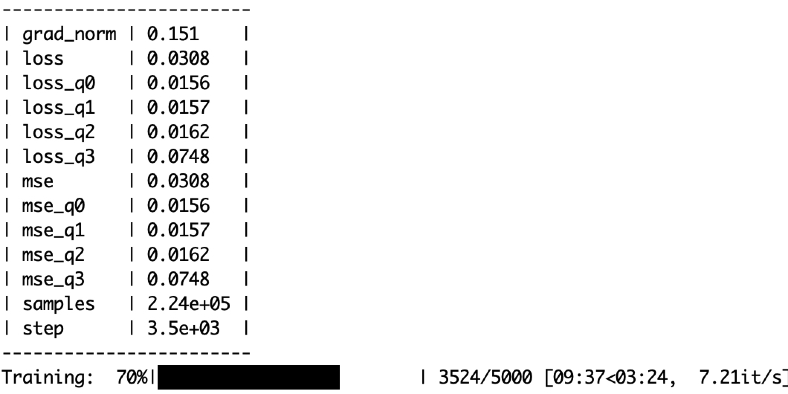
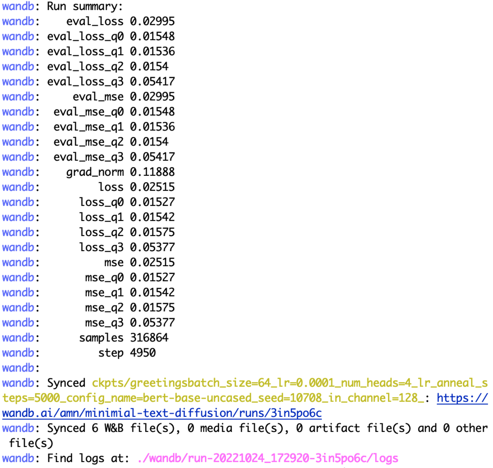

## Steps to train a model on the simple greetings dataset. 

This dataset is small to allow faster training, and the test data is simply a fraction of the [training data](https://github.com/madaan/minimal-text-diffusion/blob/main/data/greetings-train.txt). The data set was generated using few-shot prompting.


### Step 1: Tokenization

- For diffusion models trained on images, there is little pre-processing required. Each image is already a tensor of `height x width x channels.` However, when dealing with text-corpus, we need to do some pre-processing.

Specifically, we need to (i) convert the text to a sequence of tokens (integers or IDs) (tokenization) and then (ii) map each token to a continuous vector (embeddings). 

[Tokenization](https://huggingface.co/course/chapter2/4?fw=pt) is an important design choice for training a language generation model. I found word-level tokenization to be the most effective. Still, the implementation in `src/utils/custom_tokenizer` also includes BPE if you want to experiment (_intuitively, BPE trivially increases the dimensionality, so that might be hurting the performance_).

Since we are creating vocabulary from scratch, the embeddings for each token are randomly initialized. The embeddings are learned during training.


* To train a word-level tokenizer

```sh
python src/utils/custom_tokenizer.py train-word-level data/greetings/greetings.txt
```

- This creates a vocab file in `data/greetings/word-level-vocab.json.` 

- The defaults have been changed to use word-level tokenization, but please see `def create_tokenizer` in `src/utils/custom_tokenizer.py` for more details. The training code looks for the tokenizer file in `data/greetings//word-level-vocab.json` (more generally, `data/<dataset_name>/word-level-vocab.json`).

### Step 2: Training

- After creating the tokenizer, you can start training:

```sh
bash scripts/run_train.sh greetings 1 False False False 5000
```

Here, the options mean:
- `greetings`: dataset name
- `1`: GPU ID
- `False`: whether to use a pretrained model. We are training from scratch, so we set this to `False.` A finer point is that the goal of the model is not to learn good sentence representations. Instead, the goal of the model is to take noisy embeddings of text (`xt`) and predict the clean version (`x0`). So, using a pre-trained model isn't necessary.
- `False`: whether to use pretrained embeddings. We are using our word-level vocab, so this is set to `False.`
- `False`: whether to freeze the embeddings. We are training from scratch, so we set this to `False` as we want the embeddings to be learned.
- `5000`: number of training steps. This is a hyperparameter that you can tune. I found that 5000 steps are sufficient for `greetings` and training finishes in ~15 minutes.

Some boolean options may appear redundant, but they allow interesting ablations (e.g., using pre-trained embeddings but not a pre-trained model or freezing pre-trained embeddings).


* After starting the job, you should see a wandb URL. This is where you can monitor the training progress. The training process is also displayed on the terminal.


- 


- 


* The checkpoint is saved in `ckpts/greetings/.`


### Step 3: Evaluation

- After training, you can evaluate the model using the following command:

```sh
CUDA_VISIBLE_DEVICES=9 && bash scripts/text_sample.sh ckpts/greetings/ema_0.9999_005000.pt 2000 50
```

* The sampling finishes with the following note:
```written the decoded output to ckpts/greetings/ema_0.9999_005000.pt.samples_50.steps-2000.clamp-no_clamp.txt```


Let's see some random samples from the model (the command cleans the special tokens):

```sh
shuf ckpts/greetings/ema_0.9999_005000.pt.samples_50.steps-2000.clamp-no_clamp.txt|head -n 10|cut -f 2 -d '['|cut -f2 -d ']'|sed 's/^\s*//g'

i's that to see 
i's nice are see you right 
i'm let everyone you 
i's stopped a you you! 
i's glad hi see you right 
i's glad to you 
i's that to you you! 
i's glad to you you right 
i've chance to you you! 
i's greetings a you 
```

* Not bad for a model trained for 5000 steps on a small dataset!


## Controllable generation

- Let's perform controllable generation. Say we only want sentences that contain the word `good`. We assign `1` to such sentences and create a labeled file here: `data/greetings/greetings_labeled.tsv`


### Step 1: Train a classifier on the latents

```sh
python -u src/controllable/classifier.py --model_name_or_path ckpts/greetings/ema_0.9999_005000.pt --classifier_num_epochs 50 
```

- We are using the diffusion model trained above to train the classifier. Note that we don't really use the denoising process during training the classifier. We are only using the diffusion model to get the latents (i.e., run the forward or generative process).

### Step 2: Run generation!


```sh
bash scripts/ctrl_text_sample.sh ckpts/greetings/ema_0.9999_005000.pt 300 50
```


## TODO

- [ ] Expose arguments of the langevin function.
